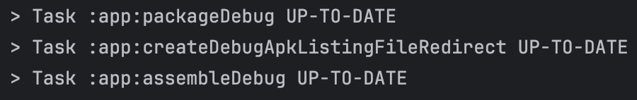
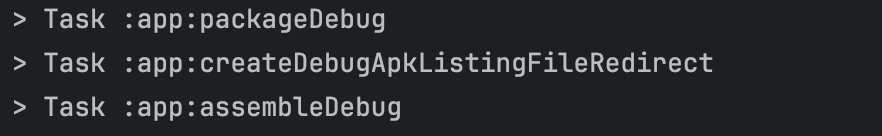
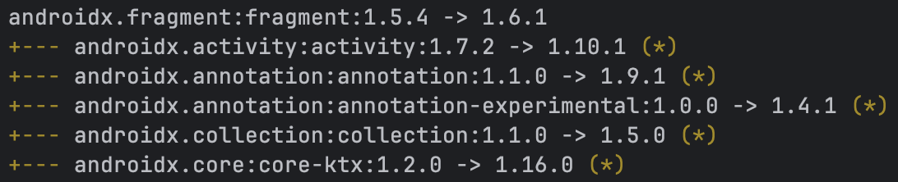

 안드로이드 앱은 일반적으로 [Gradle](https://gradle.org/)  빌드 시스템을 통해 구성된다.
전반적 시스템 이해를 위해 빌드 관련 개념들을 알아본다.
## 빌드란?
빌드: **소스 코드들을 실행 가능한 앱으로 변형**하는 것
- 애플리케이션이나 라이브러리를 분석하고, 컴파일하고, 링크 및 패키징하기 위한 여러 도구가 사용됨
- Gradle은 Task 기반의 접근 방식을 통해 이러한 명령들을 구성하고 실행
### 주요 빌드 단계
- **컴파일**: 소스 코드(.java, .kt)를 기계가 이해할 수 있는 바이트코드(.class, .dex)로 변환
	- **Compile**: .kt → .class
		- Kotlin 컴파일러(kotlinc)가 Kotlin 소스 코드를 Java 바이트코드(.class)로 변환
	- **Dexing**: .class → .dex
		- d8 또는 r8 도구가 Java 바이트코드를 Android용 Dalvik 바이트코드(.dex)로 변환
- **링크**: 컴파일된 코드와 라이브러리, 리소스를 연결하고 참조를 해석하여 하나의 실행 가능한 형태로 생성
	- Android 앱의 경우 주로 리소스 링킹을 의미
		- AAPT2를 통해 리소스를 컴파일하고 링크하여 코드가 리소스 ID로 접근할 수 있게 연결
- **패키징**: 컴파일되고 링크된 모든 파일(코드, 리소스, 설정 등)을 하나의 배포 가능한 파일(.apk, .aab)로 묶는 과정
## Task와 Plugin
**Task**는 input을 output으로 바꾸는 명령들을 캡슐화한다.
**Plugin**은 Task와 그들간의 구성을 정의한다.

**예시**
- [Android Gradle Plugin](https://developer.android.com/build/releases/gradle-plugin) (AGP): 안드로이드 앱이나 라이브러리를 만들기 위한 모든 Task들이 등록
- `java-library` 플러그인: 은 자바 소스 코드로부터 jar 파일 생성
	- jar 파일: Java ARchive, 여러 .class 파일들과 리소스를 ZIP 형식으로 압축하여 하나로 묶은 파일
- `protobuf` 플러그인: 이진 직렬화 프로토콜
	- 기존 플러그인을 확장하여 추가 기능을 제공
### 플러그인을 통한 Task 간 의존 관계 설정
빌드에 플러그인을 적용하면 Task들을 등록하고 각각의 input, output을 활용하도록 연결한다.
- input: 파일, 디렉토리 또는 Java의 타입(int, String 등)으로 표현된 정보
- output: 디스크에 쓰여야 하므로 파일 또는 디렉토리
- 한 Task의 output을 다른 Task의 input으로 연결하면 의존 관계가 생겨 순차적으로 실행
#### Convention over Configuration
Gradle은 모든 것을 직접 설정(Configuration)하게 하기보다, 합리적인 기본값(Convention)을 제공한다. 
``` groovy
// ❌ Configuration 방식 (일일이 설정)
plugins {
  id 'java-library'
}
// 모든 걸 직접 설정해야 함
sourceSets {
	main {
	  java.srcDirs = ['src/main/java']
	}
	test {
	  java.srcDirs = ['src/test/java']
	}
}
compileJava.destinationDirectory = file('build/classes')

// ✅ Convention 방식 (Gradle 기본값 사용)
plugins {
  id 'java-library'  // 이것만 써도 끝!
}
```
필요하면 DSL([Domain-Specific Language](https://docs.gradle.org/current/dsl))을 통해 추가 설정이 가능하다. 이러한 설정들은 프로젝트(및 하위 프로젝트)의 여러 빌드 파일들(`build.gradle`)에 지정되어있다.
### 빌드 로직의 위치
빌드 파일에 임의의 코드와 Task 선언을 작성하면 개발 도구가 빌드를 이해하기 어렵고 유지보수도 어려워진다.

예를 들어, Plugin의 내부 코드에 대해서는 테스트를 작성할 수 있지만, 빌드 파일에 작성된 코드에 대해서는 테스트를 작성할 수 없다. 
```groovy
// ❌ 빌드 파일 - 테스트 불가능

// build.gradle

tasks.register('myTask') {
	doLast {
	  def result = calculateSomething()  // 이 로직 테스트 못 함!
	}
}
```
따라서 빌드 로직과 Task 선언은 Plugin 내부에만 작성하고, 빌드 파일에는 그 로직을 어떻게 사용할지만 선언하는 것이 좋다.
```kotlin
// ✅ 플러그인 코드 - 테스트 가능

class MyPlugin : Plugin<Project> {
	fun calculateSomething(): Int { ... }
}

class MyPluginTest {
	@Test
	fun testCalculation() { ... }  // 가능!
}
```
## Gradle 빌드 실행 단계
Gradle 빌드는 세 단계로 나뉜다.
1. **초기화(Initialization)** 단계
	- 빌드에 포함될 프로젝트와 하위 프로젝트를 결정
	- 빌드 파일 위치를 파악하고 필요한 플러그인을 `classpath`에 추가
		- **classpath**: JVM이 클래스 파일과 라이브러리를 찾기 위해 참조하는 경로 목록
	- 주로 설정 파일(`settings.gradle`, `settings.gradle.kts`) 파일에서 작동
2. **구성(Configuration)** 단계
	- 각 프로젝트의 Task들을 등록
	- 빌드 파일(`build.gradle`, `build.gradle.kts`) 파일을 실행해 사용자의 빌드 설정을 적용
	- 이 때, 사용자의 설정 코드는 실행 단계에서 생성되는 데이터나 파일에 접근할 수 없음
3. **실행(Execution)** 단계
	- 실제로 애플리케이션을 빌드
	- 구성 단계의 결과물은 Task들의 DAG(Directed Acyclic Graph, 방향성 비순환 그래프)
		- 필요한 모든 Task간의 의존성을 표현
	- **증분 빌드**: Task의 input이 이전 실행과 다르지 않다면, Gradle은 해당 Task를 건너 뜀 
		
		| | |
		|---|---|
		|첫 빌드|이후 빌드|
		|||
		
## Configuration DSLs
Gradle은 DSL([Domain-Specific Language](https://docs.gradle.org/current/dsl))을 통해 빌드를 설정한다. 이 선언적 방식을 통해 단계별 지시 사항(명령형)을 적기보다 데이터(설정 값)을 명시하도록 해준다. 빌드 파일은 Kotlin이나 Groovy로 작성할 수 있으며, Kotlin이 현재 표준으로 자리잡고 있다.

DSL은 데이터를 더 자연스러운 방식으로 표현하는 작은 언어를 정의하는 것이다. 이를 통해 도메인 전문가나 개발자들이 프로젝트에 더욱 쉽게 기여할 수 있도록 한다.

예를 들어, 빌드의 Android 부분을 다음과 같이 설정한다.
```kotlin
android {
    namespace = "com.example.app"
    compileSdk {
        version = release(36) {
            minorApiLevel = 1
        }
    }
    // ...

    defaultConfig {
        applicationId = "com.example.app"
        minSdk {
            version = release(23)
        }
        targetSdk {
            version = release(36)
        }
        // ...
    }
}
```
내부적으로 DSL 코드는 다음과 유사하다.
```kotlin
fun Project.android(configure: ApplicationExtension.() -> Unit) {
    ...
}

interface ApplicationExtension {
    var namespace: String?

    fun compileSdk(configure: CompileSdkSpec.() -> Unit) {
        ...
    }

    val defaultConfig: DefaultConfig

    fun defaultConfig(configure: DefaultConfig.() -> Unit) {
        ...
    }
}
```
DSL의 각 블록(`android { ... }` 등) 은 람다를 인자로 받는 함수들이나, 프로퍼티를 사용하여 빌드를 설정할 수 있다. 이러한 구조 덕분에 빌드 파일의 코드가 코드가 아닌 데이터 명세처럼 보일 수 있다.
## External dependencies

과거에는 라이브러리를 사용하기 위해 직접 `JAR` 파일을 다운로드하여 프로젝트 폴더에 수동으로 넣어줘야 했다. Maven 빌드 시스템은 이러한 불편을 해결하기 위해 의존성 명세, 저장 및 관리 시스템을 도입하여 과정을 자동화했다.

Maven은 관리하는 모든 라이브러리 결과물을 **아티팩트(Artifact)**라 부른다. 수많은 아티팩트 사이에서 원하는 것을 정확히 찾기 위해, 마치 주소처럼 세 가지 정보로 구성된 식별 체계를 사용한다.
- **Group:** 제작자나 조직 (예: `com.google.dagger`)
- **Artifact:** 라이브러리의 이름 (예: `hilt-android`)
- **Version:** 버전 정보 (예: `2.50`)
- **표기 예시:** `implementation("com.google.dagger:hilt-android:2.50")`

아티팩트들은 **저장소(서버 혹은 디렉터리)**에 보관된다. 저장소에는 라이브러리 파일뿐만 아니라, 해당 라이브러리의 버전과 그것이 의존하는 또 다른 라이브러리들의 정보가 담긴 **메타데이터**가 함께 존재한다.

덕분에 사용자가 어떤 저장소에서 어떤 버전을 쓸지 지정만 하면, 빌드 시스템이 빌드 과정 중에 필요한 파일을 메타데이터를 참고하여 자동으로 다운로드한다.

추가적으로 `->` 왼쪽의 버전은 상위 라이브러리가 요청한 버전, 오른쪽의 버전은 Gradle이 최종적으로 빌드에 포함한 버전이다.

우리가 흔히 말하는 'Maven 저장소'는 특정 도구를 뜻하기보다 **아티팩트가 패키징되고 배포되는 표준 방식**을 의미한다. 이 방식이 매우 효율적이기 때문에 Gradle을 포함한 여러 빌드 시스템에서 이 표준을 재사용한다.

따라서 우리는 Gradle을 통해 오픈소스인 `MavenCentral` 같은 공개 저장소에서 라이브러리를 가져올 수도 있고, 반대로 우리가 만든 라이브러리를 저장소에 올릴 수도 있다.

외부 라이브러리를 가져와 쓰는 것과 마찬가지로, 내 프로젝트 자체를 여러 개의 **하위 프로젝트(Subprojects, 안드로이드 스튜디오에서는 '모듈'로 지칭)**로 나눌 수도 있다. 이렇게 나누어진 각 모듈은 그 자체로 하나의 의존성이 되어, 다른 모듈이나 최상위 프로젝트에서 가져다 쓸 수 있다.

각 하위 프로젝트는 빌드 과정을 거쳐 `JAR`나 `AAR` 같은 결과물을 만들어낸다. 이 결과물들은 다른 모듈에 의해 '소비'되는 구조를 가진다.

즉, 내가 만든 특정 기능을 별도의 모듈로 분리하면, 마치 외부 라이브러리를 `implementation`으로 추가하듯 내 프로젝트 안에서 자유롭게 재사용할 수 있다.

프로젝트를 모듈 단위로 격리하면 두 가지 큰 장점이 있다.
- **빌드 시간 단축:** 코드 수정이 발생했을 때 전체를 다시 빌드하는 대신, 수정이 일어난 모듈과 그에 연관된 부분만 다시 빌드하므로 효율적이다.
- **책임의 분리:** 각 모듈이 명확하게 자기 역할만 수행하도록 설계할 수 있어, 앱의 전체적인 구조가 깔끔해지고 유지보수가 쉬워진다.
## Build variants
안드로이드 앱을 만들 때 여러 개의 버전([Build Variant](https://developer.android.com/build/build-variants))을 빌드할 수 있다. 각 버전은 서로 다른 코드를 포함하거나, 다른 옵션으로 빌드될 수 있다. 이는 빌드 유형과 제품 버전의 조합으로 구성된다.

**[빌드 유형(Build Type)](https://developer.android.com/build/build-variants#build-types)**은 어떻게 빌드할지를 결정할 수 있다. 기본적으로 AGP에는 release와 debug 빌드 유형이 존재한다. 이를 수정하거나 내부 테스트용 빌드 유형 등을 더 추가할 수 있다.

- **debug 빌드**는 애플리케이션을 최적화하거나 난독화하지 않는다. 따라서 빌드 속도가 빠르고 변수나 함수의 이름 등 코드 정보가 그대로 유지된다. 또한 앱을 `debuggable` 상태로 표시하고 일반적인 디버그 키로 서명하며, 장치에 설치된 앱 파일에 접근할 수 있다.
- **release 빌드**는 앱을 최적화하고 실제 릴리즈 키로 서명하며 설치된 앱 파일을 보호한다.

[**제품 버전(Product Flavor)**](https://developer.android.com/build/build-variants#product-flavors)을 사용하면 애플리케이션에 포함될 소스 코드와 의존성 구성을 변경할 수 있다. 예를 들어 demo와 full 버전 또는 free와 paid 버전을 만들 수 있다. 공통 코드는 `src/main`에 둔 후 `src/free`나 `src/paid` 폴더를 만들어 각 버전에만 필요한 코드를 관리할 수 있다.

AGP는 각 빌드 유형과 제품 버전의 모든 조합에 따라 여러 개의 버전을 생성한다. 제품 버전을 정의하지 않았다면 빌드 유형의 이름을 따른다. 둘 다 정의하면 `<제품 버전><빌드 유형>` 형식이 된다.
예를 들어 빌드 유형이 release, debug가 존재하고 제품 버전에 demo, full이 존재한다면, AGP는 `demoRelease`, `demoDebug`, `fullRelease`, `fullDebug` 버전을 생성한다.